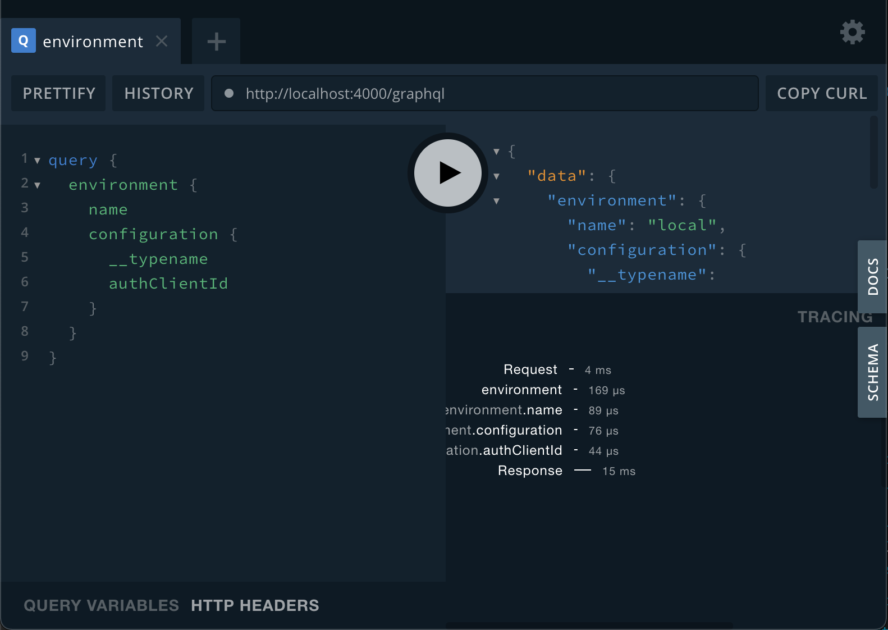

## `@envelop/apollo-tracing`

This plugin tracks execution and resolvers and reports it using
[`apollo-tracing`](https://github.com/apollographql/apollo-server/tree/main/packages/apollo-tracing)
format (based on GraphQL `extensions`).

You can see the results of the collected metrics if you are using
[GraphQL Playground](https://github.com/graphql/graphql-playground).

This is how it looks like (note the `TRACING` section):



## Getting Started

```
yarn add @envelop/apollo-tracing
```

## Usage Example

```ts
import { execute, parse, specifiedRules, subscribe, validate } from 'graphql'
import { useApolloTracing } from '@envelop/apollo-tracing'
import { envelop, useEngine } from '@envelop/core'

const getEnveloped = envelop({
  plugins: [
    useEngine({ parse, validate, specifiedRules, execute, subscribe }),
    // ... other plugins ...
    useApolloTracing()
  ]
})
```

## Notes

It's recommended to keep this plugin active only while developing only, since it's mainly used for
performance tracking while developing.
