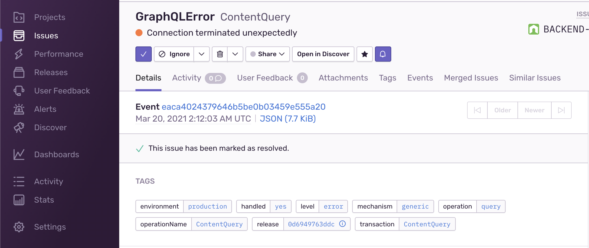
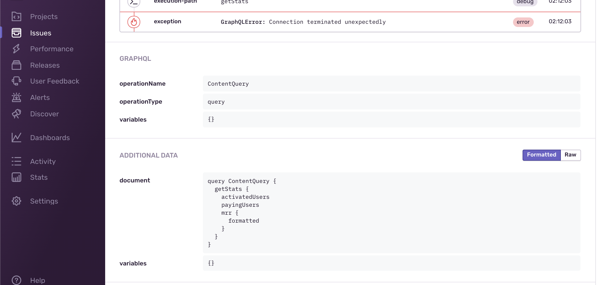
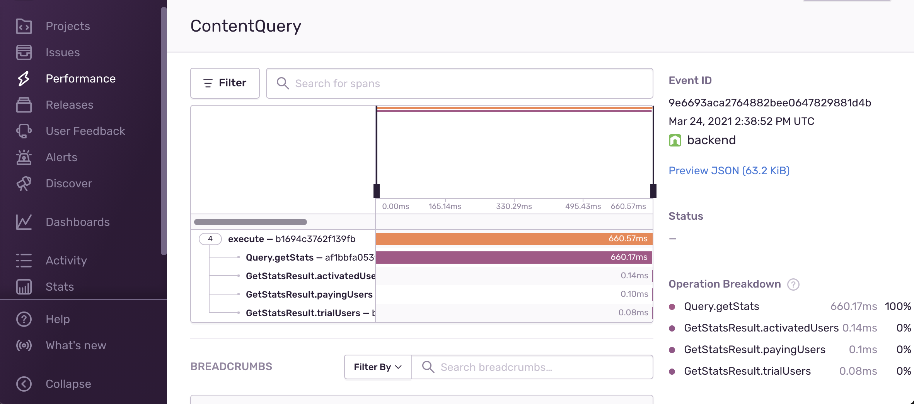
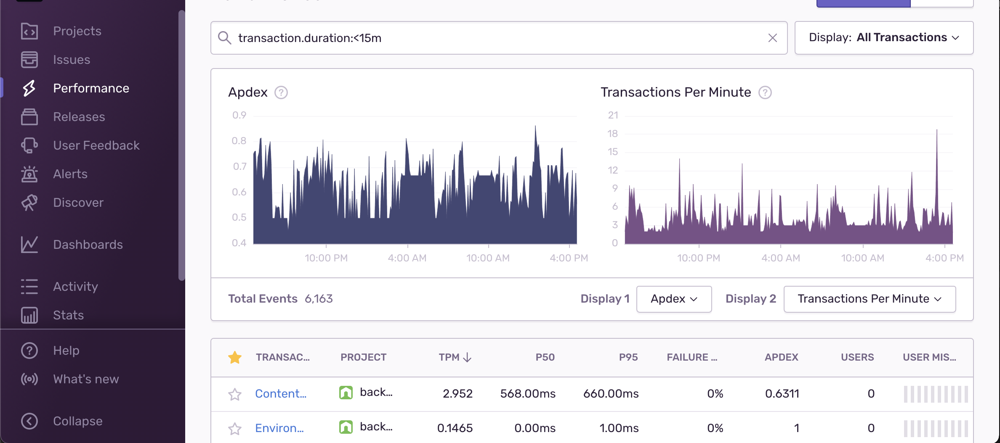

## `@envelop/sentry`

This plugins collects errors and performance tracing for your execution flow, and reports it to [Sentry](https://sentry.io/).

This is how it looks like in Sentry for error tracking:




> The operation name, document, variables are collected on errors, and the breadcrumbs that led to the error. You can also add any custom values that you need.

And for performance tracking:




> You can get information about each resolver (including field and type names), it's execution time and arguments. Also, in case of an error, the performance log and info are attached automatically to the reported Sentry error.

## Getting Started

```
yarn add @sentry/node @sentry/tracing @envelop/sentry
```

1. Start by creating an account and a project in https://sentry.io/
2. Follow the instructions to setup your Sentry instance in your application.
3. Setup Sentry global instance configuration.
4. Setup the Envelop plugin.

## Usage Example

```ts
import { parse, validate, specifiedRules, execute, subscribe } from 'graphql'
import { envelop, useEngine } from '@envelop/core'
import { useSentry } from '@envelop/sentry'
// do this only once in you entry file.
import '@sentry/tracing'

const getEnveloped = envelop({
  plugins: [
    useEngine({ parse, validate, specifiedRules, execute, subscribe }),
    // ... other plugins ...
    useSentry({
      includeRawResult: false, // set to `true` in order to include the execution result in the metadata collected
      includeResolverArgs: false, // set to `true` in order to include the args passed to resolvers
      includeExecuteVariables: false, // set to `true` in order to include the operation variables values
      appendTags: args => {}, // if you wish to add custom "tags" to the Sentry transaction created per operation
      configureScope: (args, scope) => {}, // if you wish to modify the Sentry scope
      skip: executionArgs => {} // if you wish to modify the skip specific operations
    })
  ]
})
```

### Configuration

- `startTransaction` (default: `true`) - Starts a new transaction for every GraphQL Operation. When disabled, an already existing Transaction will be used.
- `renameTransaction` (default: `false`) - Creates a Span for every resolve function.
- `trackResolvers` (default: `true`) - Wraps resolvers with tracing functionality, and creates a Span for every resolve function.
- `includeRawResult` (default: `false`) - Adds result of each resolver and operation to Span's data (available under "result")
- `includeResolverArgs` (default: `false`) - Adds arguments of each resolver to Span's tag called "args"
- `includeExecuteVariables` (default: `false`) - Adds operation's variables to a Scope (only in case of errors)
- `appendTags` - See example above. Allow you to manipulate the tags reports on the Sentry transaction.
- `configureScope` - See example above. Allow you to manipulate the tags reports on the Sentry transaction.
- `transactionName` (default: operation name) - Produces a name of Transaction (only when "renameTransaction" or "startTransaction" are enabled) and description of created Span.
- `traceparentData` (default: `{}`) - Adds tracing data to be sent to Sentry - this includes traceId, parentId and more.
- `operationName` - Produces a "op" (operation) of created Span.
- `skip` (default: none) - Produces a "op" (operation) of created Span.
- `skipError` (default: ignored `EnvelopError`) - Indicates whether or not to skip Sentry exception reporting for a given error. By default, this plugin skips all `EnvelopError` errors and does not report it to Sentry.
- `eventIdKey` (default: `'sentryEventId'`) - The key in the error's extensions field used to expose the generated Sentry event id. Set to `null` to disable.
